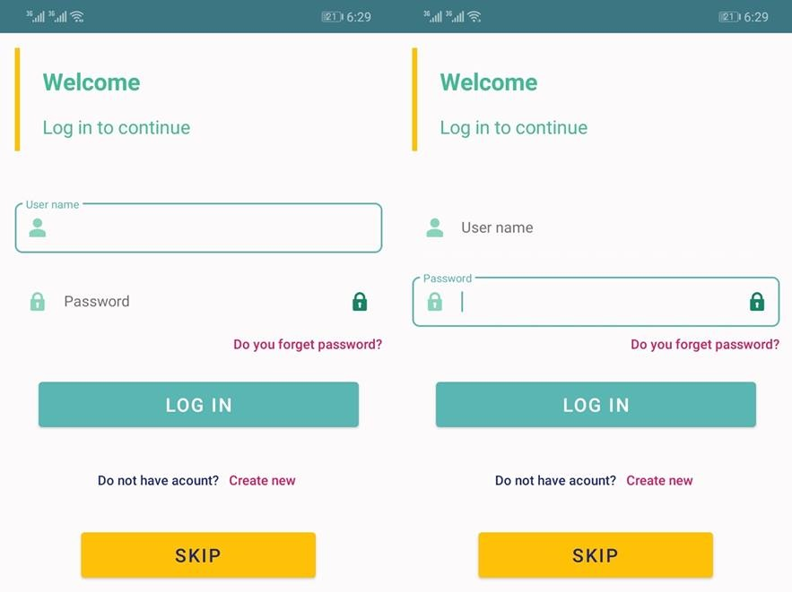
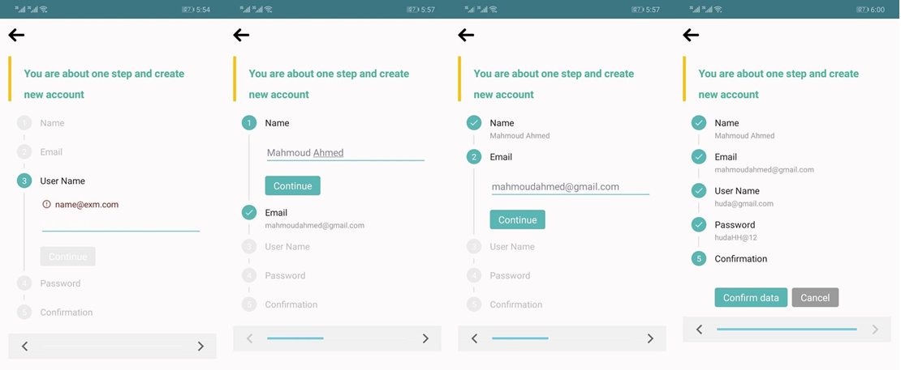
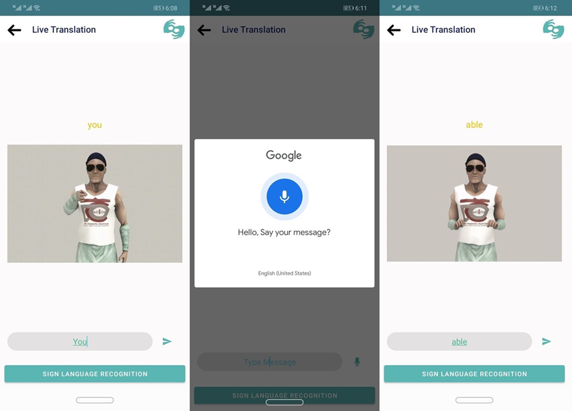
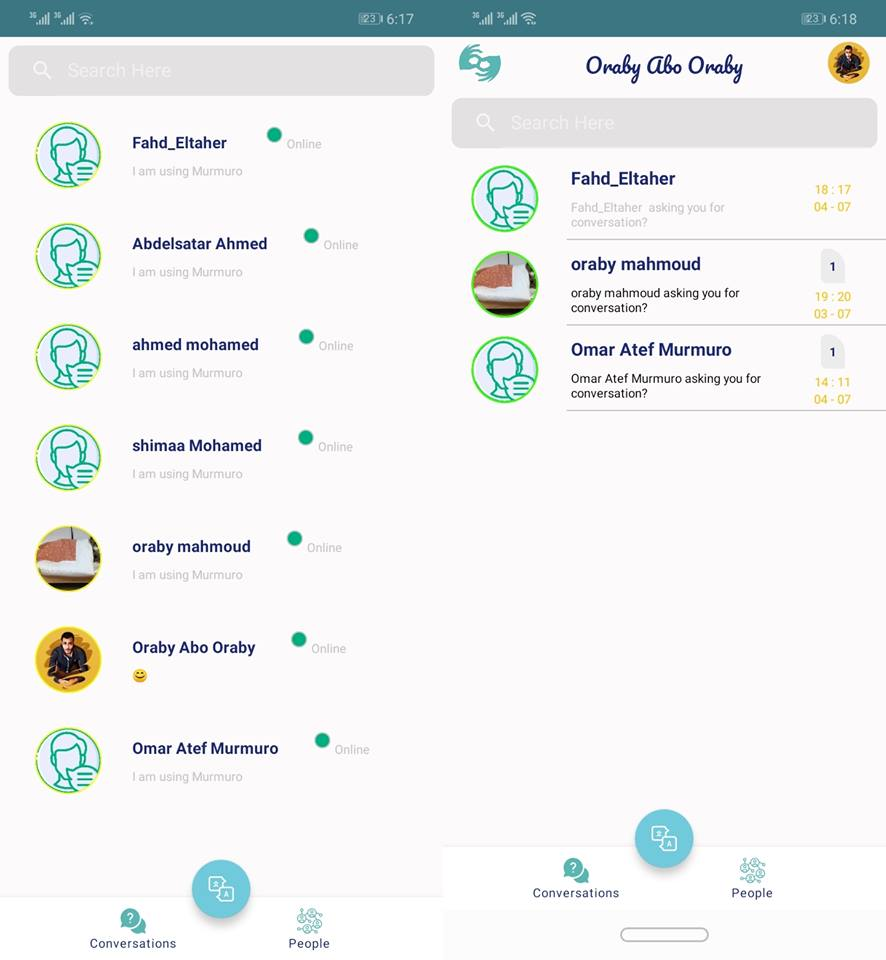
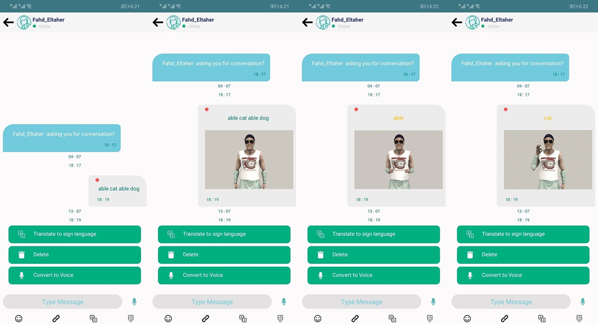
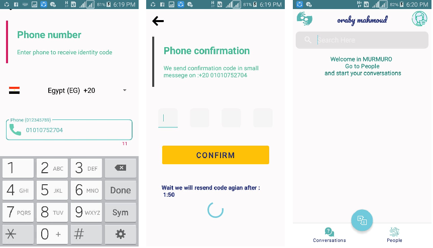

# Murmuro
Deaf People chat app

## Table of contents
* [General info](#general-info)
* [Technologies](#technologies)
* [Setup](#setup)

## General info

 Hearing loss, also known as hearing impairment, is a partial or total inability to hear. A deaf person has little to no hearing. Hearing loss may occur in one or both ears. As of 2013 hearing loss affects about 1.1 billion people to some degree. It causes disability in 5% (360 to 538 million) of the world and moderate to severe disability in 124 million people. Most of the deaf cannot read or write and also they cannot communicate with other normal people. Hearing impaired people use sign language to communicate with each other. Sign language employs signs made with the hands and other movements, including facial expressions and postures of the body. There are many different sign languages as, for example, British and American sign languages. In this project we are going to employ machine learning approaches to translate American Sign Language to normal English language to be understood by non-deaf people and also translate normal English to sign language to be understood by deaf people. Also designing is a chat application for deaf/normal people with a live translation feature 

	
## Technologies
Project is created with:
* Lorem version: 12.3
* Ipsum version: 2.33
* Ament library version: 999
	
## Setup
To run this project, install it locally using npm:

# Screens

